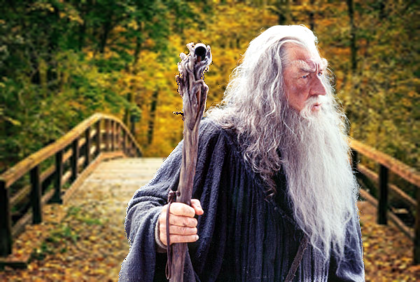

<h1>Bayesian Matting</h1>

This project implements the Bayesian Matting technique described in Yung-Yu Chuang, Brian Curless, David H. Salesin, and Richard Szeliski. A Bayesian Approach to Digital Matting. In Proceedings of IEEE Computer Vision and Pattern Recognition (CVPR 2001), Vol. II, 264-271, December 2001[1]

The implementation details is a lttle bit differenct from Paper

<ol>
<li>Instead of using the continuously sliding window for neighborhood, the project apply cv2.dilation to find the neighborhood</li>
<li>Using Gaussian Mixture Model to cluster the data points not the method of Orchard and Bouman[2]</li>
<li>Without using Gaussian falloff to weights the contribution of nearby pixels</li>
</ol>

<h2>Runing the demo</h2>
'python Bayesian Matting.py'

<h2>More Information</h2>

For more information see the orginal project website <a href="http://grail.cs.washington.edu/projects/digital-matting/image-matting/">http://grail.cs.washington.edu/projects/digital-matting/image-matting/</a>

The implementation was mostly adapted from Michael Rubinsteins matlab code here, <a href="http://www1.idc.ac.il/toky/CompPhoto-09/Projects/Stud_projects/Miki/index.html">http://www1.idc.ac.il/toky/CompPhoto-09/Projects/Stud_projects/Miki/index.html </a>

More traing,testing images and different image matting Alogorithm here, <a href="http://www.alphamatting.com/index.html">http://www.alphamatting.com/index.html</a>

<h2>Results</h2>

 origin 

trimap 

Done by Bayesain Matting(alpha) 

composite with another landScape 

<h2>References</h2>

[1] Yung-Yu Chuang, Brian Curless, David H. Salesin, and Richard Szeliski. A Bayesian Approach to Digital Matting. In Proceedings of IEEE Computer Vision and Pattern Recognition (CVPR 2001), Vol. II, 264-271, December 2001

[2] M. T. Orchard and C. A. Bouman. Color Quantization of Images. IEEE Transactions on Signal Processing, 39(12):2677–
2690, December 1991.

